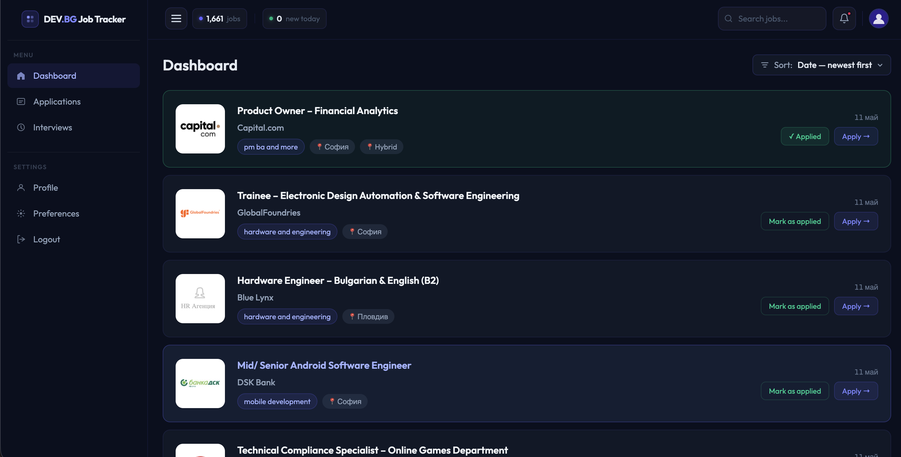
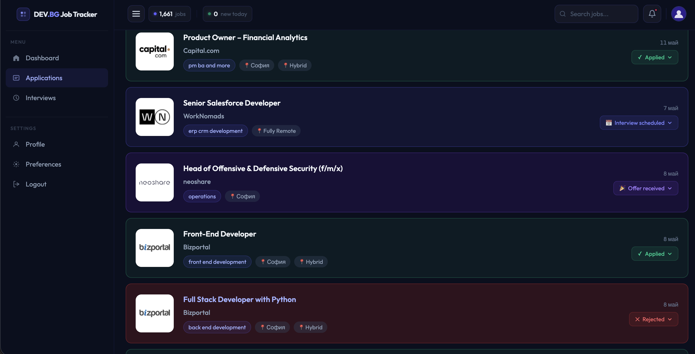
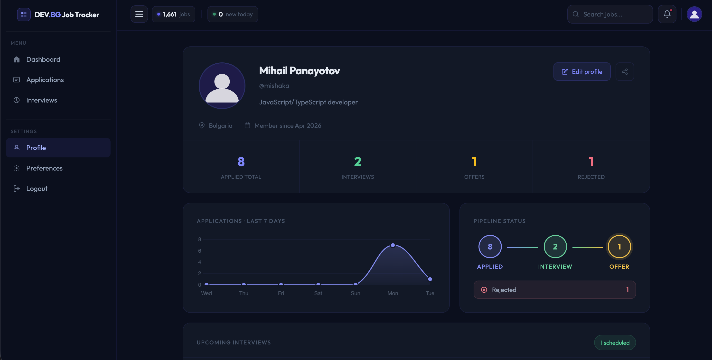

# DEV.BG Job Tracker 🇧🇬
A full-stack job tracking platform built on top of dev.bg. A Python scraper keeps a live PostgreSQL database of every job listing on the site, and a React frontend lets you browse, apply, and track each application through a full hiring pipeline.

## ✨ Features

## 🕷️ Smart Scraping Engine
A Python scraper crawls every job category on dev.bg and stores clean, normalized records in PostgreSQL. Raw HTML is never saved — only structured data.

## ⏱️ Dual Cron Strategy
Two cron jobs keep the database fresh. A full category sweep runs daily to keep every listing up to date. A lightweight first-page-only poll runs every 15 minutes to catch new posts in near real-time without hammering the database.

## 🤝 Polite & Idempotent
A 5-second delay between category requests keeps the scraper respectful — no rate limiting or blocking encountered. Deduplication is handled at the database level with `ON CONFLICT DO NOTHING`, making every scrape run fully idempotent.

## 🔐 User Authentication
Secure login and registration using JWT. Tokens are issued on login and validated on every protected endpoint — no third-party auth service.

## 📋 Application Pipeline
Track every job application through a full hiring funnel:
Applied → Interview Incoming → Offer Received / Rejected

## 📊 Personal Analytics
Your profile page gives you an overview of your job search activity — applications sent, pipeline breakdown, and more.

## 🖥️ Screenshots

## 📖 Usage
Sign up or log in to access your dashboard.
Browse 1,661+ scraped job listings sorted by newest first.
Click Apply to go directly to the listing or mark it as applied.
Track each application through the pipeline as things progress.
Check your profile for a summary of your job search activity.

## 🔗 Repositories
- Backend — https://github.com/panayotovv/job-tracker-backend
- Frontend — https://github.com/panayotovv/job-tracker-frontend

## 📄 License
This project is licensed under the MIT License.
